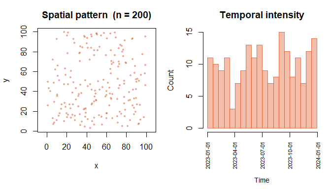
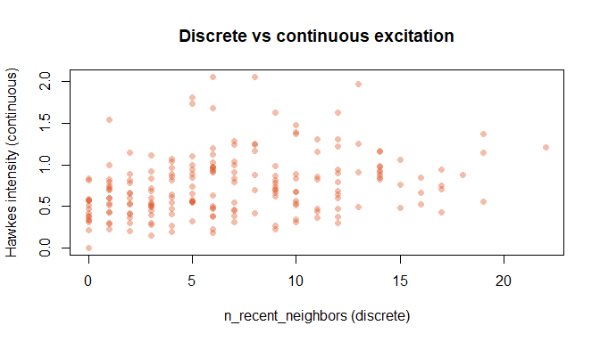

<!-- README.md is generated from README.Rmd. Please edit that file -->

# stevents

<!-- badges: start -->

[](https://github.com/ricardosp4/stevents/actions/workflows/R-CMD-check.yaml)
<!-- badges: end -->

> Lightweight S3 classes for spatio-temporal event pattern analysis in R

`stevents` provides tools for representing, manipulating, and analysing
spatio-temporal point patterns. It was designed with wildfire ignition
modelling in mind, but applies to any domain where events have both a
location and a timestamp; seismology, epidemiology, criminology.

## Installation

``` r
devtools::install_github("ricardosp4/stevents")
```

## Core classes

| Class      | Description                                              |
|------------|----------------------------------------------------------|
| `stevents` | A set of events with coordinates and timestamps          |
| `stgrid`   | A regular space-time tessellation for aggregating events |

Each class has `print()`, `summary()`, and `plot()` methods.

## Functions

| Function | Description |
|----|----|
| `count_events()` | Count events per grid cell and time bin |
| `neighbor_history()` | Count recent nearby events for each event (discrete excitation) |
| `hawkes_intensity()` | Compute the Hawkes self-excitation kernel (continuous) |
| `as_sf()` | Convert `stevents` to an `sf` point layer |
| `subset()` | Filter events by time window and/or bounding box |

## Quick start

``` r
library(stevents)

set.seed(1)
ev <- stevents(
  x    = runif(200, 0, 100),
  y    = runif(200, 0, 100),
  time = as.POSIXct("2023-01-01") + sort(runif(200, 0, 365 * 86400))
)

print(ev)
#> <stevents> spatio-temporal event pattern
#>   Events    : 200
#>   Time range: 2023-01-01 16:05:27 -> 2023-12-30 12:39:27
#>   Bounding box:
#>     x: [1.30776, 99.2684]
#>     y: [2.77871, 99.6077]
#>   CRS       : NA
summary(ev)
#> Summary of <stevents>
#>   Number of events     : 200
#>   Time span (days)     : 362.86
#>   Mean events per day  : 0.5512
#>   Bounding-box area    : 9485
#>   Mean events per area : 0.02108
```

``` r
plot(ev)
```



## Hawkes kernel

``` r
ev2 <- hawkes_intensity(ev,
  alpha = 0.8,
  beta  = 1 / (7 * 86400),
  gamma = 1 / 30
)

summary(ev2$data$hawkes_intensity)
#>    Min. 1st Qu.  Median    Mean 3rd Qu.    Max. 
#>  0.0000  0.4780  0.6917  0.7479  0.9393  2.0585
```

The continuous kernel captures finer variation than a fixed binary
window, events outside a discrete neighbourhood can still carry
non-trivial excitation.

``` r
ev3 <- neighbor_history(ev, radius = 15, lag = 30 * 86400)
ev3 <- hawkes_intensity(ev3, alpha = 0.8,
                        beta  = 1 / (7 * 86400),
                        gamma = 1 / 30)

plot(
  ev3$data$n_recent_neighbors,
  ev3$data$hawkes_intensity,
  xlab = "n_recent_neighbors (discrete)",
  ylab = "Hawkes intensity (continuous)",
  pch  = 16,
  col  = adjustcolor("#E05A2B", 0.4),
  main = "Discrete vs continuous excitation"
)
```



## Included datasets

| Dataset | Description | Source |
|----|----|----|
| `venezuela_2026` | Seismic sequence following the Mw 7.5 earthquake of 24 June 2026 | USGS |
| `amatrice_2016` | Amatrice–Norcia aftershock sequence, August–November 2016 (74 events) | USGS |

``` r
data(amatrice_2016)

events_italy <- stevents(
  x    = amatrice_2016$lon,
  y    = amatrice_2016$lat,
  time = amatrice_2016$time
)

print(events_italy)
#> <stevents> spatio-temporal event pattern
#>   Events    : 74
#>   Time range: 2016-08-24 01:36:32 -> 2016-11-14 19:49:52
#>   Bounding box:
#>     x: [12.9588, 13.3022]
#>     y: [42.6, 43.1228]
#>   CRS       : NA
```

## Motivation

`stevents` was developed as part of a Master’s thesis on spatio-temporal
Hawkes process modelling of wildfire ignition risk on the Iberian
Peninsula. The package provides the preprocessing layer between raw
event data and intensity model fitting via INLA.

## License

MIT © Ricardo
