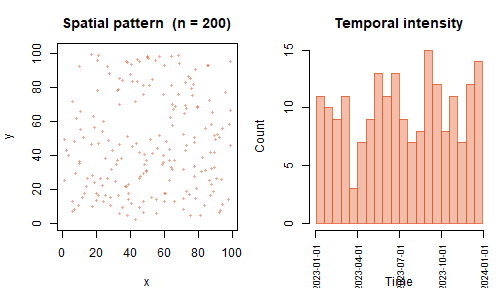
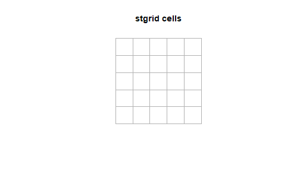
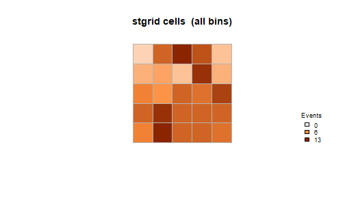
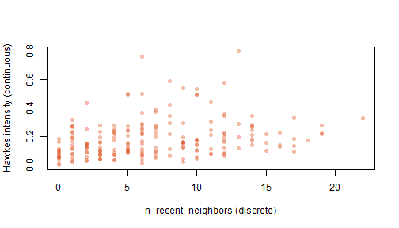

## Overview

`stevents` provides two S3 classes for spatio-temporal event analysis:

- `stevents`: a set of events with coordinates and timestamps.
- `stgrid`: a regular space-time tessellation for aggregating events.

Three functions connect them:

- `count_events()`: counts events per grid cell and time bin.
- `neighbor_history()`: counts recent nearby events for each event.
- `hawkes_intensity()`: computes the Hawkes self-excitation kernel.

## Creating an `stevents` object

An `stevents` object requires x-coordinates, y-coordinates, and
timestamps. Events are sorted by time on construction.


``` r
library(stevents)

set.seed(1)
n <- 200

ev <- stevents(
  x    = runif(n, 0, 100),
  y    = runif(n, 0, 100),
  time = as.POSIXct("2023-01-01") + sort(runif(n, 0, 365 * 86400))
)
```

`print()` shows a compact summary of the object:


``` r
print(ev)
#> <stevents> spatio-temporal event pattern
#>   Events    : 200
#>   Time range: 2023-01-01 16:05:27 -> 2023-12-30 12:39:27
#>   Bounding box:
#>     x: [1.30776, 99.2684]
#>     y: [2.77871, 99.6077]
#>   CRS       : NA
```

`summary()` reports derived statistics:


``` r
summary(ev)
#> Summary of <stevents>
#>   Number of events     : 200
#>   Time span (days)     : 362.86
#>   Mean events per day  : 0.5512
#>   Bounding-box area    : 9485
#>   Mean events per area : 0.02108
```

`plot()` shows the spatial distribution and temporal intensity:


``` r
plot(ev)
```



`subset()` filters by time window, bounding box, or both:


``` r
ev_q1 <- subset(ev,
  t_from = as.POSIXct("2023-01-01"),
  t_to   = as.POSIXct("2023-03-31")
)
print(ev_q1)
#> <stevents> spatio-temporal event pattern
#>   Events    : 44
#>   Time range: 2023-01-01 16:05:27 -> 2023-03-30 17:17:59
#>   Bounding box:
#>     x: [1.33903, 99.1906]
#>     y: [4.64609, 96.141]
#>   CRS       : NA
```

`as_sf()` converts the object to an `sf` point layer for use with
other spatial packages:


``` r
ev_sf <- as_sf(ev)
class(ev_sf)
#> [1] "sf"         "data.frame"
```

## Creating an `stgrid` object

An `stgrid` defines a regular tessellation over a bounding box and
time window.


``` r
g <- stgrid(
  bbox      = c(0, 0, 100, 100),
  cell_size = 20,
  t_window  = as.POSIXct(c("2023-01-01", "2023-12-31")),
  t_step    = "1 month"
)

print(g)
#> <stgrid> space-time tessellation
#>   Spatial cells   : 25 (20 x 20 units)
#>   Temporal bins   : 12 (step = '1 month')
#>   Time range      : 2023-01-01 -> 2023-12-31
#>   Bounding box    : [0, 0, 100, 100]
#>   CRS             : NA
summary(g)
#> Summary of <stgrid>
#>   Spatial cells          : 25
#>   Temporal bins          : 12
#>   Total space-time cells : 300
#>   Cell size              : 20
#>   Temporal step          : 1 month
#>   Time span (days)       : 364
```

`plot()` draws the spatial cells:


``` r
plot(g)
```



## Counting events

`count_events()` assigns each event to a cell and time bin:


``` r
g2 <- count_events(ev, g)
head(g2$counts)
#>   cell_id t_bin    t_start      t_end n_events
#> 1       1     1 2023-01-01 2023-02-01        1
#> 2       2     1 2023-01-01 2023-02-01        1
#> 3       4     1 2023-01-01 2023-02-01        1
#> 4       7     1 2023-01-01 2023-02-01        2
#> 5       8     1 2023-01-01 2023-02-01        1
#> 6       9     1 2023-01-01 2023-02-01        1
```

Cells are shaded by event count when plotted:


``` r
plot(g2)
```



## Neighbour history

`neighbor_history()` counts how many previous events occurred within
a given spatial radius and time lag for each event. This is a discrete
approximation of the self-excitation signal in a Hawkes process.


``` r
ev2 <- neighbor_history(ev, radius = 15, lag = 30 * 86400)
summary(ev2$data$n_recent_neighbors)
#>    Min. 1st Qu.  Median    Mean 3rd Qu.    Max. 
#>   0.000   3.000   6.000   6.795  10.000  22.000
```

## Hawkes intensity

`hawkes_intensity()` computes a continuous alternative using an
exponential decay kernel:

$$\Lambda_i = \sum_{j:\, t_j < t_i} \alpha \cdot e^{-\beta(t_i - t_j)} \cdot e^{-\gamma \, d_{ij}}$$

where $\alpha$ controls excitation magnitude, $\beta$ controls temporal
decay, and $\gamma$ controls spatial decay.


``` r
ev3 <- hawkes_intensity(
  ev2,
  alpha = 0.5,
  beta  = 1 / (7 * 86400),
  gamma = 1 / 15
)
summary(ev3$data$hawkes_intensity)
#>    Min. 1st Qu.  Median    Mean 3rd Qu.    Max. 
#> 0.00000 0.09221 0.15519 0.18459 0.23985 0.79852
```

Events with zero discrete neighbours can carry non-zero Hawkes
intensity from events just outside the fixed window:


``` r
plot(
  ev3$data$n_recent_neighbors,
  ev3$data$hawkes_intensity,
  xlab = "n_recent_neighbors (discrete)",
  ylab = "Hawkes intensity (continuous)",
  pch  = 16,
  col  = adjustcolor("#E05A2B", 0.4)
)
```


